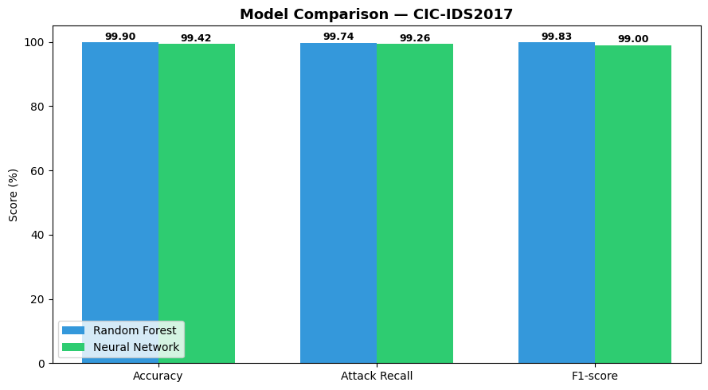
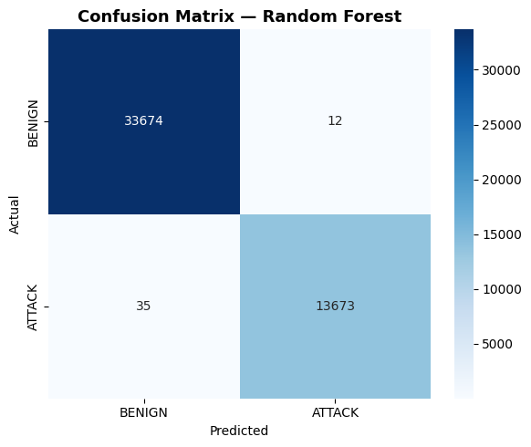
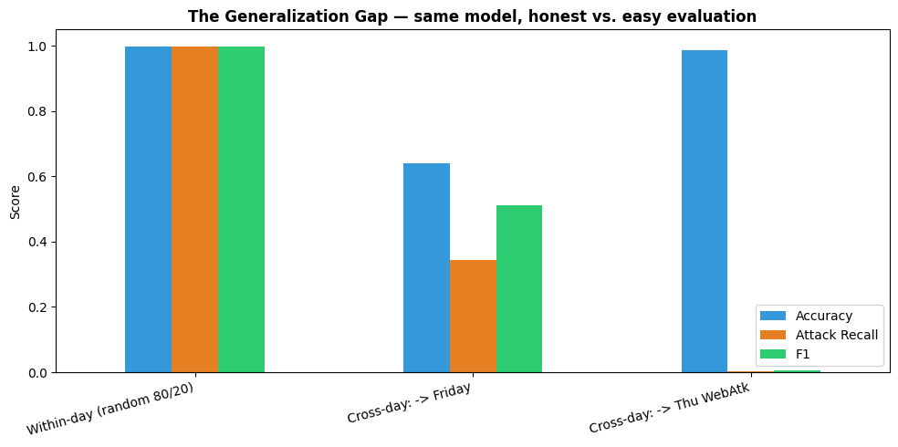
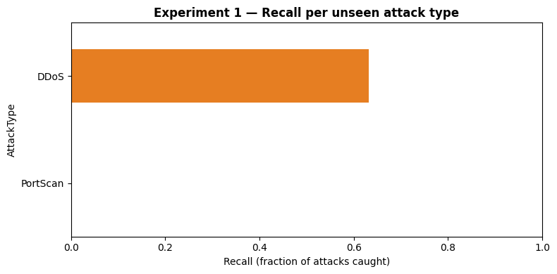

# Network Intrusion Detection with Machine Learning
### CIC-IDS2017 · Random Forest vs Neural Network · Cross-Day Generalization Analysis

**Author:** Shanzay Jamil · [GitHub](https://github.com/shay-coder) · shanzay5771@gmail.com

A machine-learning-based Intrusion Detection System (IDS) built on **CIC-IDS2017**, the benchmark
dataset from the Canadian Institute for Cybersecurity (UNB). The project deliberately evaluates
the same model twice — once the *easy* way (random split) and once the *honest* way (train on
some days, test on unseen days and unseen attack families) — and analyses the gap between them.

**The headline result, in one column of numbers:** attack recall goes

> **0.999** (random split) → **0.345** (unseen day) → **0.003** (unseen web attacks)

A model that looks essentially perfect under standard evaluation misses 2 of every 3 attacks the
first time it faces a new day, and is blind to content-based attacks — while still reporting
98.66% *accuracy*. Measuring and explaining that gap is the point of this repository.

---

## 📁 Repository structure

```
├── Network_Intrusion_Detection.ipynb   # Main pipeline: EDA → cleaning → RF & MLP → evaluation
├── Cross_Day_Generalization.ipynb      # The honest test: unseen days & unseen attack families
├── figures/                            # Exported charts (see figures/README.md)
├── data/                               # Dataset CSVs go here (not committed — see data/README.md)
├── requirements.txt
└── README.md
```

## 🚀 Quick start

```bash
git clone https://github.com/shay-coder/network-intrusion-detection.git
cd network-intrusion-detection
pip install -r requirements.txt
# Download CIC-IDS2017 CSVs into data/ (instructions in data/README.md)
jupyter notebook Network_Intrusion_Detection.ipynb
```

Runs on Google Colab too: mount Drive and set `DATA_DIR = '/content/drive/MyDrive/data/'`
(a commented line is provided in the notebooks).

## 🧪 Part 1 — Main notebook (within-day evaluation)

| Step | What happens | Why |
|------|--------------|-----|
| EDA | Class-balance analysis | Imbalanced data makes plain accuracy misleading |
| Cleaning | inf→NaN→drop, **de-duplication**, identifier columns removed | Duplicates across train/test = leakage; IPs/timestamps = shortcut features |
| Split | 80/20, **stratified** | Preserves attack/benign ratio in both sets |
| Models | Random Forest (raw features) · MLP 64→32 (standardized, early stopping) | Tree ensembles vs neural nets on tabular data |
| Evaluation | Accuracy + **Attack Recall** + F1, confusion matrix, feature importance | For an IDS, missed attacks (recall) matter more than accuracy |

### Results — random 80/20 split

| Model | Accuracy | Attack Recall | F1 |
|-------|----------|---------------|------|
| Random Forest | **99.90%** | ~0.999 | 0.9983 |
| Neural Network (MLP, converged at epoch 36) | 99.42% | ~0.99 | 0.9900 |




Random Forest wins — consistent with the well-documented pattern that tree ensembles outperform
standard neural networks on engineered tabular features. Top predictive features are flow
**timing (IAT)**, **duration**, and **packet-length statistics** — all measures of traffic
*shape and rhythm*, none of packet *content*. That observation foreshadows Part 2.


## 🔬 Part 2 — Cross-day generalization (the honest test)

No random split: train and test are entirely different capture days.

| Setup | Accuracy | Attack Recall | Precision | F1 |
|-------|----------|---------------|-----------|-----|
| Within-day baseline (random 80/20) | 99.90% | 0.999 | ~1.00 | 0.9983 |
| **Exp 1:** Train Tue+Wed → Test Friday (DDoS + PortScan) | 63.98% | **0.345** | 0.996 | 0.5127 |
| **Exp 2:** Train all other days → Test Thursday (Web Attacks) | 98.66% | **0.003** | 0.154 | 0.0061 |



### Experiment 1 — new day, one related family + one unseen family

- **DDoS: 63% recall — partial transfer.** Training included the DoS family (Hulk, GoldenEye,
  slowloris); DDoS is its distributed cousin, so flood-shaped patterns partially carry over.
- **PortScan: 0.16% recall — near-total blindness, contrary to our stated expectation.**
  We predicted scans would transfer because their shape is so distinctive. The data disagreed,
  and the *why* matters: the forest learned tight boundaries around the specific attack shapes
  it saw (floods), not an abstract "robotic traffic" concept. A scan flow — one or two tiny
  packets, then done — sits in feature space next to millions of harmless short benign
  connections. **Transfer depends on similarity to trained attack families, not on how
  distinctive an attack looks to a human.**
- Precision stayed at 0.996 while recall collapsed: unseen attacks fail *toward benign*
  (silence), not toward false alarms.



### Experiment 2 — the accuracy trap, demonstrated live

The model caught **2 of 648 web attacks** (recall 0.003) yet reports **98.66% accuracy** —
because the test day is 98.7% benign and predicting "benign" for everything is enough. A
near-total detection failure wearing a 99% badge: the textbook argument against accuracy on
imbalanced data, reproduced on real traffic.

The failure is **structural, not a tuning problem**: XSS/SQL-injection maliciousness lives in
the HTTP payload text, and flow features never observe payload. No extra data or model capacity
recovers a signal the features do not carry — the fix is *different features* (payload-aware
models, behavioural/graph representations), which is precisely the current research frontier in
ML-based intrusion detection.

## 📌 Key findings

1. **Within-day detection of volumetric attacks is essentially solved** by a plain Random Forest
   on flow features (99.90%) — and that number is close to meaningless for deployment.
2. **The generalization gap is the real result:** recall 0.999 → 0.345 → 0.003 as the test moves
   from familiar campaigns to unseen days to unseen attack families.
3. **Accuracy is the wrong metric for IDS.** Exp 2 scores 98.66% accuracy while detecting 0.3%
   of attacks. Attack recall and F1 are reported throughout.
4. **Attack-family similarity, not visual distinctiveness, drives transfer** (the PortScan
   surprise) — an honest negative result, kept and analysed rather than hidden.
5. **Flow features are structurally blind to content-based attacks**, motivating payload-aware
   and behavioural-graph approaches rather than more data or bigger models.

## ⚠️ Assumptions & limitations (read before citing numbers)

- **Binary framing.** All attack types collapse to ATTACK=1; attack-type identification is future work.
- **Flow-level features only.** No payload/content inspection; raw packet bytes unused.
- **Subsampling.** 50k rows randomly sampled per CSV (seeded) for tractability. Rare classes are
  under-represented — the Thursday test file contains only **7 SQL Injection samples**, so
  per-class recalls on small classes are noisy.
- **Single lab environment.** Even the cross-day experiments stay inside CIC-IDS2017 — one
  network topology, one week, simulated users. True deployment shift (different network/era)
  would be harder still; cross-dataset evaluation on CSE-CIC-IDS2018 is the natural next step.
- **Known dataset caveats.** CIC-IDS2017 has documented labelling/flow-construction issues
  (Engelen et al., 2021; Lanvin et al., 2023); results on corrected releases can differ.
- **No hyperparameter tuning.** Defaults + fixed seeds, deliberately — comparisons isolate
  data-handling effects, not tuning effort.

## 🗺️ Roadmap

- [ ] Multi-class attack-type classification with per-class confusion matrix
- [ ] Class-imbalance treatments (class weights, SMOTE) targeting Web-Attack recall
- [ ] 5-fold stratified cross-validation (mean ± std instead of single-split numbers)
- [ ] Gradient-boosted trees (XGBoost / LightGBM) benchmark
- [ ] Feature selection: retrain on top-15 features for real-time feasibility
- [ ] Cross-dataset test on CSE-CIC-IDS2018
- [ ] Payload-aware features for the web-attack blind spot
- [ ] Minimal live demo: CICFlowMeter output → trained model → alerts

## 📚 Dataset & citation

CIC-IDS2017 — Canadian Institute for Cybersecurity, University of New Brunswick.
Download instructions in [`data/README.md`](data/README.md). If you use the dataset, cite:

> Sharafaldin, I., Habibi Lashkari, A., & Ghorbani, A. A. (2018). *Toward Generating a New
> Intrusion Detection Dataset and Intrusion Traffic Characterization.* ICISSP 2018.

## License

MIT — see [LICENSE](LICENSE).
